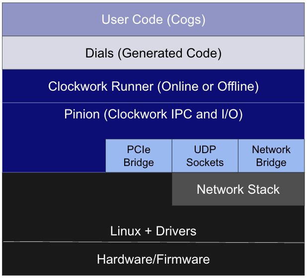

# Clockwork

_Open-source middleware for safety critical AV and robotics applications._


> [!WARNING]
> This project is alpha-stage software.
> It is not stable and is subject to rapid changes.
> Public APIs may change without notice, and backward compatibility is not guaranteed.
> No support is provided at this time.
> Use at your own risk.

## Table of contents

- [What is Clockwork?](#what-is-clockwork)
- [Why use Clockwork?](#why-use-clockwork)
- [Key features](#key-features)
- [Runtime stack](#runtime-stack)
- [Getting started](#getting-started)
- [Learning Clockwork](#learning-clockwork)
- [Getting help](#getting-help)
- [Contributing](#contributing)
- [Authors](#authors)
- [License](#license)

## What is Clockwork?

Clockwork is an infrastructure framework designed to help you build safety-critical, real-time autonomy and robotics applications.
It’s built by a team of experts with decades of experience building similar systems at multiple AV and robotics companies.

Clockwork aims for safety, reliability, consistency, and bounded resource utilization.
It achieves these primary goals by:

- Managing CPU, memory, and network bandwidth.
- Imposing constraints that guide and restrict the way user code is written.
  - These constraints enable fully deterministic offline (simulated-time) execution of the user code for reproducible simulation and testing.
- Managing IPC through standardized and efficient interfaces.
- Managing scheduling and execution of user code.
- Abstracting details of underlying hardware, enabling user code to execute in multiple environments (target hardware, workstation, cloud) without changes, and being easily portable to new target hardware.
- Providing well-specified system configurations and configuration management.
- Providing data representation formats suitable for both onboard and offboard use from multiple programming languages.

[Back to top](#table-of-contents)

## Why use Clockwork?

Clockwork addresses the gap for open source middleware for production grade autonomy systems by delivering:

- Performant communications for AI systems
  - Highly efficient, ultra low latency message handling
  - Zero-copy, zero-serialization communications when on the same device
- Deterministic offboard execution capability, supporting offboard evaluation of AI systems
  - Critical for key development processes like resimulation
- Rich specification config language
  - Greater predictability in execution by allowing developers to specify what software runs where, and how software components connect
  - Retains flexibility to enable rapid system change/development
- Bounded resource utilization management
  - Pre-allocates memory and pre-schedules execution while ensuring compliance with pre-defined resource budgets
- Support for schema evolution with backward compatibility

[Back to top](#table-of-contents)

## Key features

Clockwork v0.1 will allow users to build basic autonomy applications with foundational performance and reliability characteristics.
Key features include:

- Foundational features
  - Pub/sub messaging, task execution (C++ and Python[^1]), spy tools, deterministic offline playback, X86 & Arm CPU support, and UDP socket support
- Multi-system support
  - Multi-node deployment with TCP Bridge support
- Onboard logger and offboard log converter
  - An onboard writer and a tool to convert log messages to MCAP offboard
  - Access to Clockwork-native data from C++ and Python
  - Conversion to/from Protobuf for other languages
- Simple reference application and documentation
  - A “Hello, World!” sample application demonstrating the use of Clockwork with associated documentation

[^1]: Python support intended for rapid prototyping only, not for production-ready systems.

[Back to top](#table-of-contents)

## Runtime stack



- **OS:** Linux
- **Components:**
  - [Pinion](clockwork/pinion/README.md): The underlying message-passing layer for Clockwork to enable communication between Cogs.
  - [Runner](clockwork/runners/README.md): Executes Cogs according to their execution requirements.
  - [Dials](clockwork/dial/README.md): Contains all of the interfaces/APIs that the Cog needs to interact with the system.
  - [Cogs](clockwork/cog/README.md): User code implemented as a C++ or Python class that can only consume inputs and produce outputs as specified in the [Clockwork Domain-Specific Language (DSL)](clockwork/dsl/README.md)
- **Compiler:** Clang

[Back to top](#table-of-contents)

## Getting started

### Prerequisites

- Ubuntu 22.04 LTS[^2]

### Dependencies

- Install git: `sudo apt install git`
- Install [Bazelisk](https://github.com/bazelbuild/bazelisk#installation)
  - Make sure you install it as `bazel` in your `PATH`.

### Installation instructions

Clone the repo:

```bash
git clone https://github.com/stackav-oss/clockwork.git
```

Build and run the tests to confirm:

```bash
cd clockwork/
bazel test //...
```

### Next steps

Take a look at the [Helloworld](clockwork/examples/helloworld/README.md), and the [Demo system](clockwork/examples/demo_system/README.md) examples.

[Back to top](#table-of-contents)

[^2]: Clockwork likely works on other linux distros, but currently we support Ubuntu 22.04.

## Learning Clockwork

Check out the [Clockwork Docs](clockwork/docs/README.md) for more technical documentation, including:

- Clockwork overview:

  - [Clockwork 101](clockwork/docs/clockwork101.md): overview of Clockwork’s essential concepts, including Cogs, data, system composition, and scheduling and resource allocation.
  - [Hello, World! tutorial](clockwork/docs/tutorial/helloworld.md): create a simple Clockwork system.
  - [Clockwork system composition](clockwork/docs/concepts/composition.md): overview of the system composition workflow.
  - [Schemas, representations, and interfaces](clockwork/docs/concepts/schema_repr_iface.md): introduction to the concepts of schemas, representations, and interfaces.

- Guidance:

  - [Init value guidance](clockwork/docs/guidance/init_values.md): explains how and when to use initialization specifications in Clockwork schemas.
  - [Type inference guidance](clockwork/docs/guidance/type_inference.md): provides guidance on when to rely on type inference in the Clockwork language and when to use explicit types.

- Troubleshooting:
  - [Clockwork troubleshooting](clockwork/docs/troubleshooting.md): steps for debugging and resolving common issues when building or deploying a Clockwork system.

[Back to top](#table-of-contents)

## Getting help

There is extensive documentation in the [Clockwork Docs](clockwork/docs/README.md).

If you have questions, concerns, or bug reports, please file an issue in Clockwork's Issue Tracker.

[Back to top](#table-of-contents)

## Contributing

We appreciate community interest in this project.
However, external contributions are not being actively accepted at this time.
By submitting any feedback, suggestions, or pull requests, you acknowledge that they may be used without any obligation of compensation, attribution, or acceptance into the project.
Your understanding is appreciated.

[Back to top](#table-of-contents)

## Authors

Clockwork was developed by Stack AV.

### About Stack AV

Stack develops revolutionary AI and advanced autonomous systems designed to enhance the safety, reliability, and efficiency of modern freight and supply chain systems.
Stack AV’s technology – coupled with an advanced approach to safe systems design and testing – is designed to maximize trucks' uptime, optimize existing infrastructure and improve roadway safety.
Stack AV is committed to driving the trucking industry forward by enabling smarter supply chains for its partners, allowing them to deliver goods to their consumers faster and more safely.
To learn more, please visit [Stack AV's website](https://stackav.com).

[Back to top](#table-of-contents)

## License

Copyright 2025 Stack AV Co.

Licensed under the [Apache License, Version 2.0](LICENSE.txt).

[Back to top](#table-of-contents)
