# Clockwork channels, input views, and conditions

This document details the semantics of Clockwork channels, input views and input conditions, which are both critical concepts for any engineer implementing Cogs.
They are related but distinct concepts: An _input view_ is a sliding window of messages on an input channel which is visible to the Cog on a specific execution of the Cog, while an _input condition_ is what triggers the Cog to execute in the first place.
Input views determine what data is available to a Cog, while input conditions determine when and how often the Cog executes.

> [!WARNING]
> The default behavior in Clockwork, unless you specify otherwise, is to aggressively give your Cogs _the most recent_ messages on a channel, which means Clockwork will aggressively skip messages by default if they arrive faster than you execute!
> **If you want Clockwork to make a best effort to deliver every message, you have to specify that explicitly!**
> This is done with the `max` parameter of a `new_messages` condition combined with the correct input view size as explained below.
> If you want the common use case of "just deliver every message one at a time" that's described as the [every message use case](#every-message) below, but this is not the default behavior.
> The default behavior is what some frameworks might call a "latest message" pattern, not an "every message" pattern.

## TL;DR on views vs conditions

The separation of inputs views and input conditions is a feature not found in most frameworks, and it might be confusing at first.
You can always just follow the [examples](#common-use-cases) below for the common cases, but if you want to understand views vs conditions in the simplest way possible, think of this:

> [!TIP]
> An input **view** determines _what messages_ your Cog sees on each execution.
> An input **condition** determines _when_ and _how often_ your Cog executes.

These two things are often combined in one in other frameworks, which typically just support the common patterns: "give me every message one at a time" (the [every message](#every-message) pattern) or "just give me the latest message" (the [latest message](#latest-message-or-latest-n-messages) pattern).
Many other frameworks _only_ support those two patterns (or even just one of them).
By separating views and conditions, Clockwork enables many more use cases to be directly addressed.

## Channels

The logical idea of a Clockwork channel is an infinite, ordered stream of messages: $M_i$.
But channels need to be physically realized, and infinity is a difficult thing for finite hardware, so the physical realization of a channel is a sequence of the most recent _N_ messages from that abstract infinite stream. In this case, _N_ is encoded as the `max_num_messages` parameter on a channel definition:

```clk
channel SomeChannel
{
    message_type: Tachyon<SomeMsg>;
    max_num_messages: 8;
}
```

That defines a channel which holds at all times the eight most-recently-published messages on the channel.
As new messages are published beyond eight, old messages disappear from the channel.

> [!NOTE]
> Messages never expire from a channel except by being displaced by a new message.
> If you only ever publish one message to a channel, it'll just be there available until the system restarts.
> At system start (or restart) all channels are empty.

## Input views

An input view is a window onto the channel: a contiguous sub-sequence of the messages currently in the channel.
Input views have a fixed maximum size, defined in the domain-specific language (DSL) when the Cog is defined with the `max_msgs` parameter.
The view will contain _up to_ this maximum size.
If there are fewer messages than that available on the channel (e.g., at startup) then the view will be smaller.

> [!NOTE]
> Like channels, once views fill up, they never shrink, because the channels never shrink.
>
> Note that _all_ messages in the channel, not only "new" messages (which we define below) are on the view.
> So it is normal for a message to appear in the input view on more than one Cog execution, at least in the general case.
> If you want only _new_ messages, there is a method on the input view called `get_new_msgs_view()`, which returns a range (compatible with range iteration) of only new messages, and there's also `get_first_new()` which returns an iterator to the first new message in the view.
> (This may be `end()` if there are no new messages.)

The input view slides along this sequence of messages over time, though for any given execution of the Cog the view is fixed and will not change.
In general, the view will have the most recent N messages in it, or at least Clockwork attempts to make this so, but in a distributed system various things can interfere with this, and it's certainly possible for there to be a message that's been published which isn't yet visible to the Cog, due to latency and timing issues.
The view will only move forward, or not at all, in between Cog executions, and never backward.

The default view size if not specified is one. To change the size of the view, set `max_msgs` on the input:

```clockwork
some_input: Tappy<SomeMsg>
{
    max_msgs: 3;
}
```

> [!IMPORTANT]
> Views are _fixed_ during the execution of a Cog.
> Even if new messages arrive during that execution, they will not be visible to the Cog.
> See below for a worked example.

### Example

Let's illustrate how views work over executions with some examples:

#### Time t0

At t0 in this example, there have already been eight messages M0-M7 published to the channel, and Clockwork is about to execute the consumer Cog, but it hasn't executed yet.

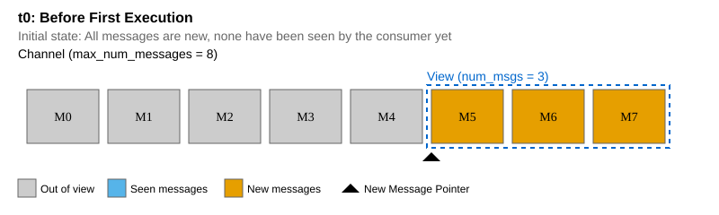

The diagram above shows the state of the view for that first execution.
Clockwork always tries to give you the most recent messages, so the view starts at the end of the channel, with the most recent three messages M5-M7.
The messages outside the view (M0-M4) are in the channel, but cannot be accessed by this consumer.
All three messages in the view are considered new, and the new pointer points to M5.

#### Time t1

Let's say another message M8 arrives _while the consumer is still executing_ at t1.

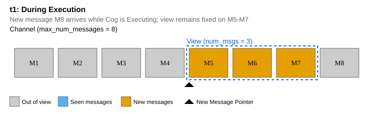

Because input views are fixed during execution, the new message is outside the view; the view still contains M5-M7 as before.

#### Time t2

Now the Cog has finished executing, and is ready to execute again.

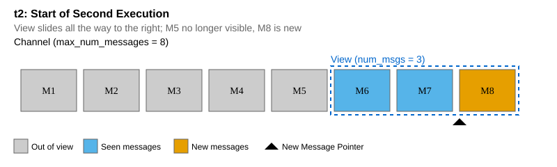

Because we've completed that first execution, the view can move, and so it does.
Clockwork shifts it to the right as much as it can, which brings M8 into the view.
M6-M7 are also still in the view, because they can be; there's only one new message.
The new message pointer is at M8.
M6-M7 are considered "seen" because they were in the view at the last execution, but this is the first execution where M8 has been visible, so it's new.

#### Time t3

Let's say that second execution is very slow, or a burst of new messages arrives for some reason.

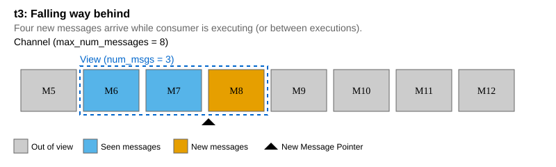

There are now more unseen messages waiting than can fit in the Cog's input view.
Remember they are invisible to the Cog while it's executing.

> [!WARNING]
> The scenario described here is very problematic for another reason: the Cog is taking so long to execute that it's view is about to drop out of the channel entirely; this is called "overrun".
> This is a fault situation if it happens and will lead to the Cog being killed unless the input is set to copy mode.
> The details of handling this fault and copy mode are outside the scope of this document; for our purposes here, just make sure those channels are configured to be large enough that the view never "falls off" the end of the channel!
> See also the note on [sizing](#choosing-input-view-size) below.

#### Time t4

Clockwork's default behavior is shown here, which is to keep the Cog up to date.
It always slides that view window all the way to the right (newest messages), and in this case because four messages arrived while only three fit in the view, that means we "drop" M9:

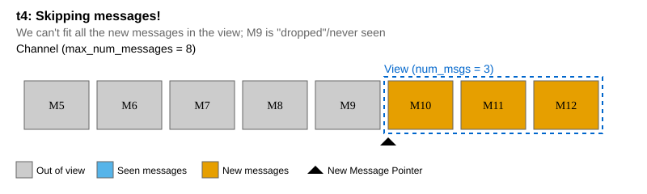

It's not really dropped; it's there in the channel, but from the perspective of the Cog it appears to be dropped because it was never visible on any execution: we went from M6-M8 on the last execution to M10-M12 on this execution.

Of course since M10-M12 have not been seen before, they are all considered new.

### Choosing input view size

The size of the view (`max_msgs` on the input definition) should be large enough to give your Cog all the messages it needs, but not too close to the max number of messages on the channel (`max_num_messages` on the channel definition).
A reasonable baseline size if you'd rather not drop messages is twice the number of messages you expect to receive between executions of your Cog.
This allows your Cog to avoid missing messages, as long as it is running at close to its nominal frequency.
(Technically making it exactly the number of messages you expect to receive between executions would be adequate, but this provides no margin for error; this is why as a rule of thumb we double it.)

Larger view sizes can be set, but bear in mind that newer messages are likely more valuable to you than older ones, and if your Cog is often running at less than half its nominal frequency, you probably _need_ to discard some older messages to "keep up".

> [!WARNING]
> As described above, messages in the view are "frozen" and cannot be updated by Clockwork while your Cog is running.
> If, while your Cog is running, enough new messages are received to fill the rest of the message buffer, an "overrun" will occur, indicating that your Cog is not keeping up with the rate of incoming messages.
> This is a serious fault and you should make sure it doesn't happen.
>
> For example, if the `max_num_messages` on a channel is eight, and you have `max_msgs: 6` on your input, and more than two new messages are received while your cog is running, an overrun will occur.
> Unless messages are published on the channel at a very low rate, this view size is likely too high relative to the channel size, and you should either increase `max_num_messages` or lower `max_msgs` to give more headroom for new messages to arrive while your Cog runs.

See for example [the example above](#time-t3) showing a similar situation.
Here we can illustrate how dangerous a channel size of eight and view size of six would be:

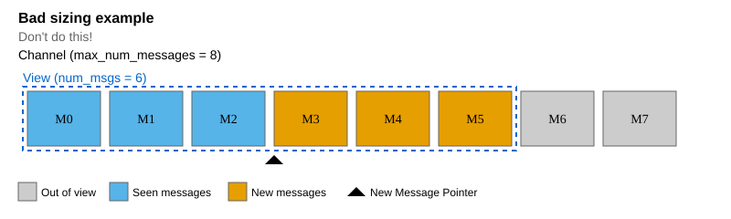

There you see that just two new messages M6-M7 arriving during execution is the most you can tolerate.
If M8 arrives also, that's overrun (a fault).

### Use views instead of copying to local state

It's important to note that Clockwork implements views efficiently, without extra memory use or copying[^1].
It's common in robotics code written for other frameworks to copy messages into a component's local state, but in Clockwork this is unnecessary and inefficient.
Instead, use views to always have the most recent N messages available to you.

[^1]: It will be possible to explicitly request copying in some cases. This is not yet fully implemented.

In particular, there's a very common pattern where user code wants "the most recent message" on an input.
This is what you get by default in Clockwork, with the default view size of one.
(Though see the discussion on `max` parameters to input conditions below, which can cause input views to explicitly not always have the latest message; this only happens if you ask for that behavior though, such as in the [every message use case](#every-message).)
There is no reason to keep your own "most recent" copy.

### Cursors

Views also have a concept of a "cursor".
A cursor is a pointer to a message in the view.
You can choose either automatic or manual cursor control.
If you choose automatic cursor control (the default), then the cursor and the first new iterator are always the same.
If you choose manual cursor control, then the cursor only advances when you advance it, or when the message the cursor points to falls out of the view because new messages have entered the view.
(In that case, it points to the oldest message still in the view.)

Manual cursor control can optionally be used for Cogs which don't always process all of their inputs on every execution, and want to keep track of which one they last processed.
This can be useful for message alignment or other purposes.
In this case, opt in to manual cursor control, and manually advance the cursor as you process messages in the view.

### Avoiding overruns

The producer and consumer(s) of a channel communicate using a ring buffer in shared memory.
As an optimization, access to the shared memory region is done without locking or copying by default.
This means there is a risk of the producer of a channel overwriting messages while a consumer is reading them.
This can happen if the producer is bursty or if the consumer consistently executes slower than the message arrival rate.
This section describes several means you can employ to address this risk and avoid having your processes terminated.

> [!IMPORTANT]
> As a last resort, Clockwork will avoid undefined behavior from overruns by terminating the process that is executing the affected cog.
> There are two cases that will result in process termination.
> In both cases, the name of the overrun input will be printed to the console log before termination.
>
> 1. Ideally we can detect overruns _right before_ they happen and abort.
>    This way we can be more confident that memory hasn't been corrupted.
>    To that end, when the infrastructure thread receives a notification about an event related to a cog that is currently being executed on another thread, it will check all of the cog's inputs.
>    If for any input the producer's position in the channel is within `max(2, channel_size*0.1)` slots of the executing cog's view, the infrastructure thread will terminate the process.
> 2. As a backstop, _after_ executing a cog the execution threads will also check to see if any of the cog's inputs were overrun.
>    If an overrun occurred while the cog was running, any outputs generated by the cog will be discarded and the process will be terminated.

#### Copying

The simplest way to mitigate the risk of undefined behavior from a producer overwriting your Cog's inputs is to have Clockwork copy inputs out of the buffer before it executes your Cog.
You can request this behavior by adding `copy_inputs: true;` to your input view parameters.
Note that this setting may not be appropriate for high throughput Cogs, as the extra copies take time and consume memory bandwidth.
It's also important to note that enabling copying will increase the amount of memory, memory bandwidth, and CPU time used by your cog, as Clockwork needs to allocate storage for the entire input view and copy each message into it.

> [!NOTE]
> Many of the remedies described in the sections below only apply to inputs that are associated with `new_message` conditions that use the `max` parameter.
> If your cog is being overrun and the relevant input does not meet those criteria, you probably want to enable input copying if addressing the root cause of the overrun is non-trivial.

#### Resize your channels

Sometimes a cog isn't pathologically slow, but is instead sensitive to bursts from upstream producers.
Another simple way to avoid overruns in this case is to increase the size of the channel between the bursty producer and the sensitive consumer.
Similar to copying, this remedy can be applied to inputs regardless of their association with execution conditions.

> [!NOTE]
> Increasing channel sizes increases memory usage, especially for channels with large messages types.
> In many cases you should consider [adding a rate limiter](../reference/exec_conditions.md#rate-limiting) to the bursty producer before increasing your channel size.

#### Preemptive skipping

When a Cog uses the `new_messsage` execution condition with the `max` parameter, Clockwork will make its best effort to deliver messages without any skips.
However, in some cases you may decide that it is okay for your Cog to skip forward if it would mitigate the risk of getting overrun by the producer.
You can indicate this preference by setting the `skip_threshold` parameter on your Cog's input view.
This property's value is interpreted as the maximum number of messages to allow the Cog to fall behind before skipping to the most recent messages.
It is an error to use `skip_threshold` unless the input has an associated `new_message` condition that uses `max`.

You might want your Cog to behave differently in the event of a skip.
If so, you may check how many messages you skipped in the current cycle by calling `num_messages_skipped()` on the relevant input dials.
Note that `num_messages_skipped()` will be present on the dials of any inputs associated with a `new_message` condition that uses `max`.
But, it will only ever return non-zero if a skip occured to keep the consumer from exceeding the safety threshold.

#### Safety margin

When a Cog uses the `new_message` condition with the `max` parameter, Clockwork will check the distance from the producer's position to the beginning of that Cog's view.
If this distance is too small, Clockwork will reset the consumer's view to the most recent messages before executing it.
By default, this distance must be greater than half the channel size or the size of the consumer's view; whichever is bigger.
You can override this behavior by setting the `safety_margin` parameter on your Cog's input view.
The value may not be greater than the size of the channel minus two.

> [!IMPORTANT]
> While they seem similar at first glance, there are two important differences between the `safety_margin` and `skip_threshold` parameters.
>
> 1. They operate in opposite directions: `safety_margin` is compared to the gap between the producer's position and the beginning of the consumer's view— i.e. it is counting messages the consumer has already seen which have fallen out of the view, while `skip_threshold` is compared to the gap between the end of the consumer's view and the producer's position (i.e. messages the consumer has yet to see).
> 2. When `safety_margin` is violated, a fault is raised so the operator of the system knows there is a risk of a timing fault, while skips caused by `skip_threshold` do not.

> [!IMPORTANT]
> During compilation Clockwork will validate the safety margins for all input views (including those using the default margin).
> In particular, it will ensure that the following holds for all channel-input connections: `view_size + safety_margin <= channel_size`.
> Compilation will fail if any channel-input connections within a box violate this condition, as it would be impossible to satisfy at runtime.
> If your system fails to compile because of this check and you didn't specify a safety margin, be sure that the `max_msgs` field on your input satisfies the following condition: `max_msgs + max(max_msgs, channel_size/2) <= channel_size`

## Input conditions

As we said at the beginning, input conditions are used to determine _when_ and _how often_ your Cog executes.
This is critical to understand, particularly if the default "latest message" behavior is not what you want!
Input conditions are one type of [execution condition](../reference/exec_conditions.md) which are what control when a Cog executes.
There are also execution conditions for time-based execution (e.g., periodic execution or timeouts), but here we discuss only input conditions, which are about messages.

> [!WARNING]
> In case we haven't said it enough, if you want to receive every message on a channel without skips, your input conditions are critical!
> Read and understand this section and the [common use cases](#common-use-cases)!

> [!NOTE]
> You don't _need_ an input condition on your input at all!
> Unless you want messages on that input to control when your Cog executes, you can just have the input view and no condition on that input.
> You'll need some _other_ condition to cause your Cog to execute.
> Whenever it does execute, the most recent `max_msgs` (view size) messages will be available to your Cog.
> But without a condition, that input will never _cause_ your Cog to execute.

There are two types of input conditions: `any_message` and `new_message`.

### Any message

The `any_message` condition is the simpler one.
It has a single parameter `min` which defaults to 1.
This condition is active if there are at least `min` messages available on the channel.
This is only useful to _prevent_ a Cog from running at startup until it has messages available on some of its inputs, without caring whether those messages are new or not.
If you can't do anything until a message is available, an `any_message` condition is appropriate.
You simply won't execute until messages have been published on that channel.

### New message

A `new_message` condition is activated when new messages are available, which seems obvious, but here the relationship between input conditions and input views becomes important, because we need to define what "new" means in this context.

A new message is simply a message which has not been present in the input view for that input on any previous execution of the Cog.
Each message can be "new" only on one execution of the Cog, and what is considered new is unaffected by the [cursor](#cursors), even if manual cursor control is used.
On subsequent executions, it may still be in the view, but it won't be new.
So you can think of "new" as meaning "unseen".
For purposes of a `new_message` condition, only new messages are relevant.

This condition has two parameters: `min` and `max`.
The default `min` parameter is 1, and the default `max` is "infinite" (or "none").
The meaning of the `min` parameter is intuitive; there must be at least that number of new messages for the condition to be active.

The `max` parameter is more subtle.
If it is set, this is a request to Clockwork to make a best effort to execute your Cog at least once for every `max` messages on the input.
It's best to illustrate how this is useful through some examples, which are below.
The `max` parameter is really only useful with `new_message`.

Remember that the default `max` value if unspecified is "infinite".
This is essentially telling Clockwork that it is not required to execute you for every new message, or at least that it does not need to make any "best effort" to do so.
This is how the default behavior in Clockwork becomes "latest" rather than "every".

> [!TIP]
> If you want to receive every message on a channel without skips, you _must_ use the `max` parameter of `new_message`, and `max` must be less than or equal to the view size (`max_msgs` on the input definition).
> In the common "[every message](#every-message) one at a time" use case both of these parameters should be 1, which satisfies that requirement.
> But any `max` that's less than or equal to input view `max_msgs` will cause Clockwork to make a best effort to deliver every message.

Let's work through an example where the view size is three and there's a `new_message(max=2)` condition on the input.
Remember that `min=1` is the default, so this is the same as `new_message(min=1, max=2)`.

#### Time t0

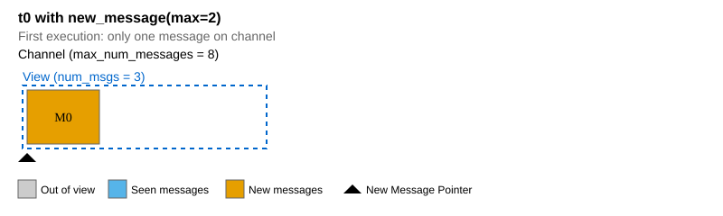

Here the first message gets published.
This satisfies the `min=1,max=2` constraint so the Cog executes.

#### Time t1

Let's say that while that first execution was running (or in between executions), _three_ new messages arrive.

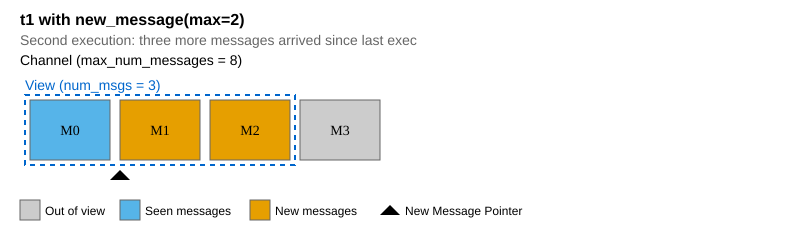

If this were a default input without a `new_message(max=...)` condition, we would have just zoomed that view all the way to the right.
But this illustrates how `max` actually works: it prevents us from delivering more than `max` new messages to a single execution (in this example 2).
So Clockwork holds the view back, keeping M3 out of it even though it's available.

#### Time t2

Now immediately after that execution begins, we can start a new one:

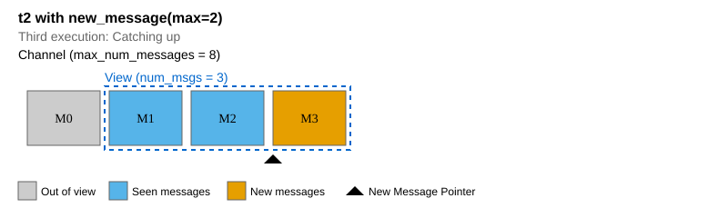

This assumes that M4 hasn't arrived yet.
If it had, then the view would include it, because that would still satisfy the `max=2` constraint.
But because `min=1`, Clockwork does not have to wait for a second message to arrive.

#### Time t2': What if `min=2` and `max=2` instead?

Let's consider that same scenario with `min=2`:

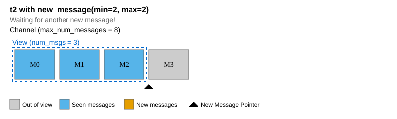

Here we have one eligible new message M3, but `min=2` prevents us from executing until we have another one.

> [!TIP]
> While a `max` parameter makes you run _faster_ in order to not skip messages, a `min` parameter can hold you back, forcing you to wait until more messages are available on the input.

#### Time t3': What if `min=2` and `max=2` instead?

When M4 arrives, we can execute:

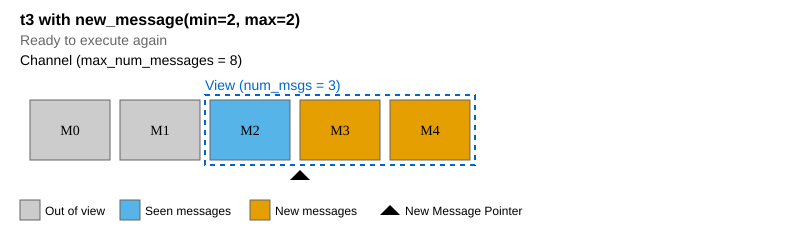

So this is why `min` exists as well: if you really want to execute for exactly half of the messages (or any ratio), you can use `min` to make that happen.
It even works if view size is less than `min`!
If the view size were one here, the view would just skip every other message.
View size and condition parameters operate independently, but the combination is what determines how your cog behaves.

## Common use cases

Below are some common use cases, and how to implement them with a combination of view size and input conditions.

### Every message

If you just want every message on a channel delivered one at a time, this is easy: Set your view size (`max_msgs` on the input definition) to one.
This is the default, so you don't actually have to do anything!
Then, create a `new_message(max=1)` execution condition.
You're done.

### Every N messages

Here you want `new_message(min=N,max=N)` to exactly divide the input frequency by N to determine your execution frequency.
If you want to see every message but only execute less frequently, then your view size should be N.
If you actually want to skip N-1 messages each time, seeing only every Nth message, then the default view size of one will do it.

### Latest message or latest N messages

If you want the latest message on a channel, but don't want that channel to trigger your Cog to execute, then you only need an input view with the defaults and no input conditions on _that_ input.
(You might have conditions on other inputs, or you might have a time-based condition.)

Your view can be whatever size you like, to get from one (default) to N latest messages in your view.
Even without an input condition on the view, the view will be populated when some other condition triggers your Cog to execute.

Without an input condition, your "latest" view might be empty, particularly during system startup.
If there's no point in executing your Cog until messages on one of your inputs are available, this is what the `any_message` condition is for.
Add this, with a suitable `min` parameter, to prevent your Cog from being executed at startup until you have the essential messages you need.
